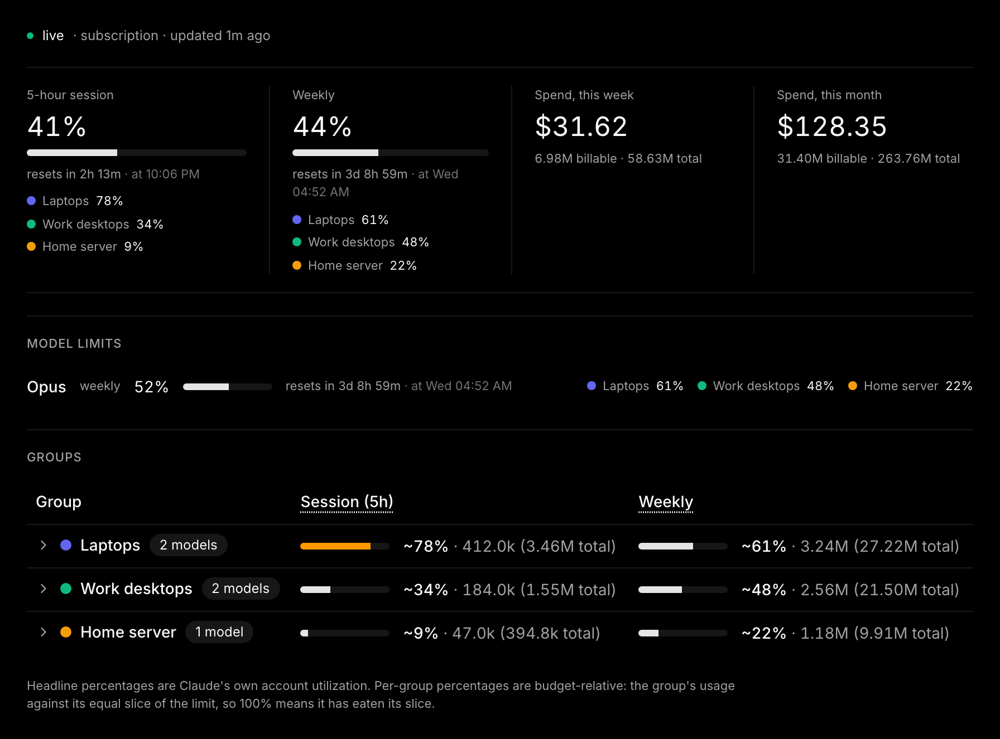
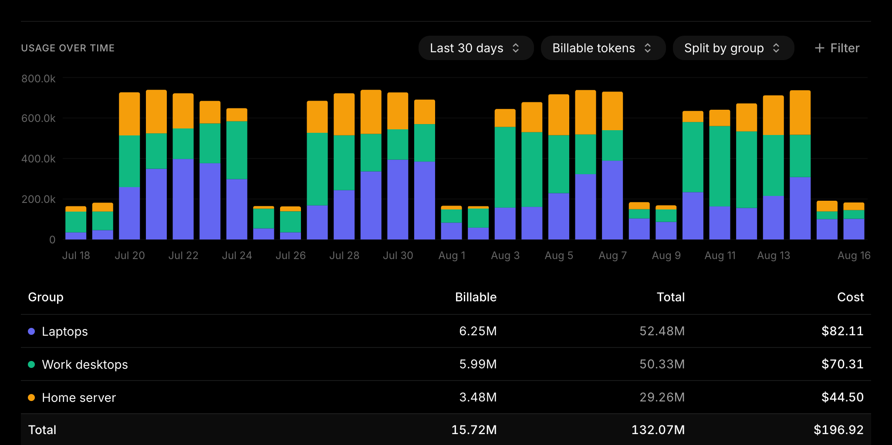

<p align="center">
	
</p>

<p align="center">
	<a href="https://www.npmjs.com/package/@usagefleet/cli"></a>
	<a href="https://www.npmjs.com/package/@usagefleet/cli"></a>
	<a href="LICENSE"></a>
</p>

One subscription, many machines. UsageFleet reports Anthropic's **own**
5-hour and weekly utilization and splits it across the device groups you define,
so you can see which laptop, desktop or server burned the window.

**[usagefleet.com](https://usagefleet.com)** — sign in with GitHub or Google.
Free for one device.

## What you get



The percentages are Anthropic's, not an estimate: a small collector on each
machine reads them from Anthropic's own usage endpoint (the one Claude's
`/usage` screen uses) with the Claude login you already have there, falling
back to the `anthropic-ratelimit-unified-*` response headers for API keys.
UsageFleet only *splits* them, by each group's share of estimated cost.

A group's number is measured against **its own slice** of the account (1/N with
N groups), so "62%" means that group used 62% of its budget — not 62% of yours.

## Get started

1. Sign in at [usagefleet.com](https://usagefleet.com).
2. **Devices** → add a device, pick a group, copy the token (shown once).
3. On that machine:

```bash
npm i -g @usagefleet/cli
usagefleet login uf_xxx
```

The dashboard fills in within a minute. Same two commands on macOS, Linux and
Windows; the collector then runs in the background at login and updates itself.
Full manual: **[apps/cli/README.md](apps/cli/README.md)**.

> Phones are out of scope — the Claude mobile app keeps no local usage logs.

## What it reads, what it sends

Read-only tailing of local agent logs: Claude Code
(`~/.claude/projects/**/*.jsonl`), Claude Desktop agent-mode sessions, and the
[pi](https://github.com/badlogic/pi-mono) agent (Anthropic-provider records
only).

Uploaded: token counts, model, session id, hostname, working directory, git
branch. Never uploaded: prompts, responses, file contents, or your Claude
credentials — the limits reading is signed locally and only the resulting
percentages leave the machine.

## Plans

| Plan | Devices (= max groups) |
|------|------------------------|
| Free | 1 |
| Solo | 2 |
| Fleet | 8 |
| Custom | 10–200, priced per device |

Prices and checkout live on [usagefleet.com](https://usagefleet.com). Cancel any
time; the free plan keeps working.

## Also in the box

- **Alerts** — desktop notification the first time a window crosses 80% / 95%.
- **Guard** — `usagefleet guard` is a Claude Code hook that refuses new prompts
  once a group is over a window it blocks on. Fails open on any problem.
- **Spend** — cost estimate per window, group and model, from published pricing.
- **History** — past 5-hour blocks and weeks, plus a per-project usage explorer.



## Development

Two Bun workspaces, one lockfile: `apps/web` (TanStack Start + better-auth +
Drizzle + Postgres) and `apps/cli` (`@usagefleet/cli`, zero runtime deps).

```bash
docker run -d --name usagefleet-db -e POSTGRES_DB=app -e POSTGRES_USER=app \
  -e POSTGRES_PASSWORD=app -p 5432:5432 postgres:17-alpine
cp .env.example .env   # one .env at the repo root serves compose and dev
bun install
bun run db:migrate
bun run dev            # http://localhost:3000
bun run test           # usage math + collector unit tests
```

Schema changes: edit `apps/web/src/db/schema.ts`, run `bun run db:generate`,
commit the SQL under `apps/web/drizzle/`.

| Path | What |
|------|------|
| `apps/web/src/db/` | Drizzle schema (auth, subscription, groups, devices, usage) |
| `apps/web/src/lib/usage/` | fold, windows, pricing (pure, tested); the group split lives in `lib/data.ts` |
| `apps/web/src/routes/api/v1/usage.ts` | ingestion endpoint (`x-api-key`, dedup on `uuid`) |
| `apps/web/src/routes/_dash/` | dashboard, groups, devices, billing, settings, admin |
| `apps/cli/` | the `usagefleet` collector |

- [`docs/architecture.md`](docs/architecture.md) — request flow, data model, auth, billing.
- [`docs/usage-math.md`](docs/usage-math.md) — fold, windows, the group split, pricing.
- [`docs/collector.md`](docs/collector.md) — CLI internals.
- [`CONTRIBUTING.md`](CONTRIBUTING.md) — setup, style, what to read first.
- [`SECURITY.md`](SECURITY.md) — reporting a vulnerability.

## License

[GPL-3.0-or-later](LICENSE). Run it, modify it — published modifications stay
under the same license.
